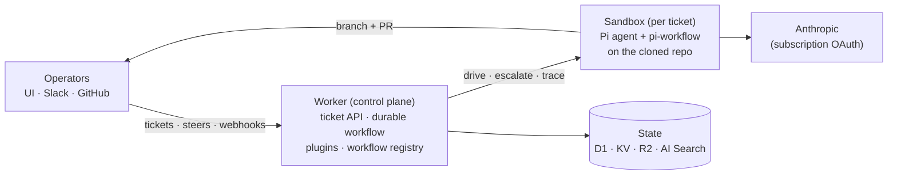

# Workhorse

**Controllable autonomous coding agents.** A Cloudflare-native fleet
orchestrator: file a ticket, an agent plans and implements it autonomously
in an isolated cloud sandbox, using a small model kept capable by giving it
the right tools and context at each workflow stage.

## Architecture



**Planes:**

| Plane | Runs on | What |
|---|---|---|
| Spine | Cloudflare Workflows | one durable instance per ticket; drives, escalates, parks, revises |
| Muscle | Cloudflare Sandbox | per-ticket Firecracker container; clone/build/test |
| Brain | Anthropic (Claude subscription OAuth) | Pi agent + pi-workflow, baked into the sandbox image |
| Memory | D1 + KV + R2 + AI Search | records (tickets/escalations/indexes) in D1; hot state in KV; blobs (traces, repo memory) in R2; distilled run knowledge fleet-wide in AI Search |
| Token custody | MacBook homelab server | holds+refreshes the OAuth refresh token; mints short-lived access tokens |
| Face | Nuxt UI (`ui/`) | fleet dashboard: tickets, live steer, chat, traces, diffs |

**Workspace (hard boundaries):** `packages/api` is the contract; each
`plugins/<name>` package depends on it and nothing else (enforced by
workspace resolution); `worker/` is the only package that imports concrete
plugins. A plugin's optional `extension.ts` is auto-discovered by the
sandbox image build. Workflows are user data: repo
`.workhorse/workflows/<name>/` → KV registry → baked seeds.

## API (bearer-gated)

```
POST /tickets {title?, repo, prompt}       → durable run (custodian token used)
GET  /tickets · GET /tickets/:id           → fleet list / record + live status
POST /tickets/:id/steer {message}          → interrupt + redirect the live stage
POST /tickets/:id/heal · /stop             → re-dispatch errored / terminate
GET  /tickets/:id/activity · /traces · /diff
POST /chat {messages}                      → fleet operator agent
GET/PUT/DELETE /workflows/:name            → workflow registry (spec validated)
POST /workflows/seed                       → import baked bundles
POST /knowledge/search {query}             → fleet knowledge (scoped token ok)
POST /webhooks/github · /webhooks/slack    → signature-verified sources
```

## Dev

```
bun install
bun run typecheck    # all workspace packages
bun run dev          # local worker (needs Docker for the sandbox container)
bun run deploy       # deploy worker + container image (from worker/)
```

Secrets: `SPIKE_TOKEN` (master bearer), `GITHUB_TOKEN`,
`GITHUB_WEBHOOK_SECRET`, `BROWSER_TOKEN` (scoped sandbox callbacks);
optional: `SCRAPFLY_KEY` (unblocker), `SLACK_SIGNING_SECRET` +
`SLACK_BOT_TOKEN` (Slack surface). Dev values in `.dev.vars` (git-ignored).

Roadmap: [ROADMAP.md](./ROADMAP.md). Legacy Workhorse (TS core, core-v2/v3,
Rust orchestrator) lives on the `legacy` branch.
