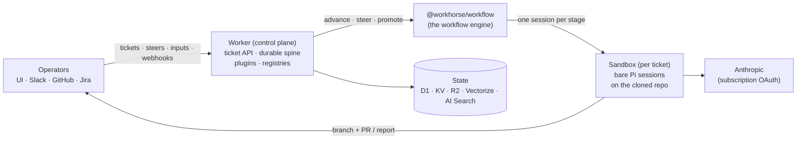

# Workhorse

**Controllable autonomous coding agents.** A Cloudflare-native fleet
orchestrator: file a ticket, an agent plans and implements it autonomously
in an isolated cloud sandbox, using a small model kept capable by giving it
the right tools and context at each workflow stage.

## Architecture



**Planes:**

| Plane | Runs on | What |
|---|---|---|
| Spine | Cloudflare Workflows | one durable instance per ticket: durability plumbing only — bursts, parks (`waitForEvent`), retries, delivery |
| Engine | `packages/workflow` | the workflow semantics: spec compile + validation, graph routing, per-stage prompt assembly, run state, control verbs (steer / promote / inject-input / cancel), typed failure classification |
| Muscle | Cloudflare Sandbox | per-ticket Firecracker container; each stage is one bare Pi session with a CLI-enforced tool ceiling |
| Brain | Anthropic (Claude subscription OAuth) | Pi + extensions, baked into the sandbox image |
| Memory | D1 + KV + R2 + Vectorize + AI Search | records in D1; hot state in KV; blobs (traces, repo memory, dep cache) in R2; semantic registries (scripts/workflows/tools) in Vectorize; fleet-wide run knowledge in AI Search |
| Token custody | MacBook homelab server | holds+refreshes the OAuth refresh token; mints short-lived access tokens |
| Face | Nuxt UI (`ui/`) | chat-first home, fleet list, run-centric ticket page with live agent output, workflow builder (vue-flow), agent blocks, `/embed` for dashboards |

**Workspace (hard boundaries):** `packages/api` is the contract; each
`plugins/<name>` package depends on it and nothing else (enforced by
workspace resolution); `worker/` is the only package that imports concrete
plugins. A plugin's optional `extension.ts` is auto-discovered by the
sandbox image build.

**Everything user-facing is data, not code:** workflows (repo
`.workhorse/workflows/<name>/` → KV registry → baked seeds), agent blocks
(persona + tool ceiling, referenced by `stage.agent`), and scripts (agent
self-extension, D1 registry) are all registry entries editable from the UI.
A workflow's terminal stage declares its outcome — `pr` (external merge
completes), `report`/`artifact` (operator acceptance completes) — and
stages can park mid-run for operator input (`awaiting-input`) rendered as
schema-driven forms. Completion signals are pluggable
(`Core.signalTransition`): PR merge, Jira Done, and the UI's Accept button
are the same mechanism.

## API (bearer-gated)

```
POST /tickets {title?, repo, prompt, workflow?, inputs?} → durable run
GET  /tickets · GET /tickets/:id            → fleet list / record + live status
POST /tickets/:id/steer {message}           → interrupt + redirect the live stage
POST /tickets/:id/input {answers}           → answer an awaiting-input park
POST /tickets/:id/accept · /request-changes → acceptance verdicts (report/artifact)
POST /tickets/:id/heal · /stop              → re-dispatch errored / terminate
GET  /tickets/:id/activity · /output · /traces · /diff
POST /chat {messages}                       → fleet operator agent
GET/PUT/DELETE /workflows/:name             → workflow registry (engine-validated)
GET/PUT/DELETE /agents/:name                → agent block registry
GET  /scripts · POST /scripts               → script registry (scoped)
GET  /find?corpus=scripts|workflows|tools   → semantic search (scoped)
GET  /github?path=…                         → read-only GitHub proxy (scoped)
POST /search {query}                        → web search (provider chain)
POST /knowledge/search {query}              → fleet knowledge (scoped ok)
POST /webhooks/github · /slack · /jira      → verified sources
```

## Dev

```
bun install
bun run typecheck    # all workspace packages
bun run test         # vitest (engine unit tests on a mock driver)
bun run eval         # evalite (evals/ — validator + search providers)
bun run dev          # local worker (needs Docker for the sandbox container)
bun run deploy       # deploy worker + container image (from worker/)
```

Secrets: `SPIKE_TOKEN` (master bearer), `GITHUB_TOKEN`,
`GITHUB_WEBHOOK_SECRET`, `BROWSER_TOKEN` (scoped sandbox callbacks);
optional: `SLACK_SIGNING_SECRET` +
`SLACK_BOT_TOKEN` (Slack), `JIRA_BASE_URL`/`JIRA_EMAIL`/`JIRA_API_TOKEN`/
`JIRA_WEBHOOK_SECRET`/`JIRA_AGENT_ACCOUNT` (Jira intake), `NTFY_URL` +
`NTFY_TOPIC` (push), `TAVILY_API_KEY`/`EXA_API_KEY`/`BRAVE_API_KEY` +
`SEARCH_PROVIDER` (web search). Dev values in `.dev.vars` (git-ignored).

Roadmap: [ROADMAP.md](./ROADMAP.md). Legacy Workhorse (TS core, core-v2/v3,
Rust orchestrator) lives on the `legacy` branch.
