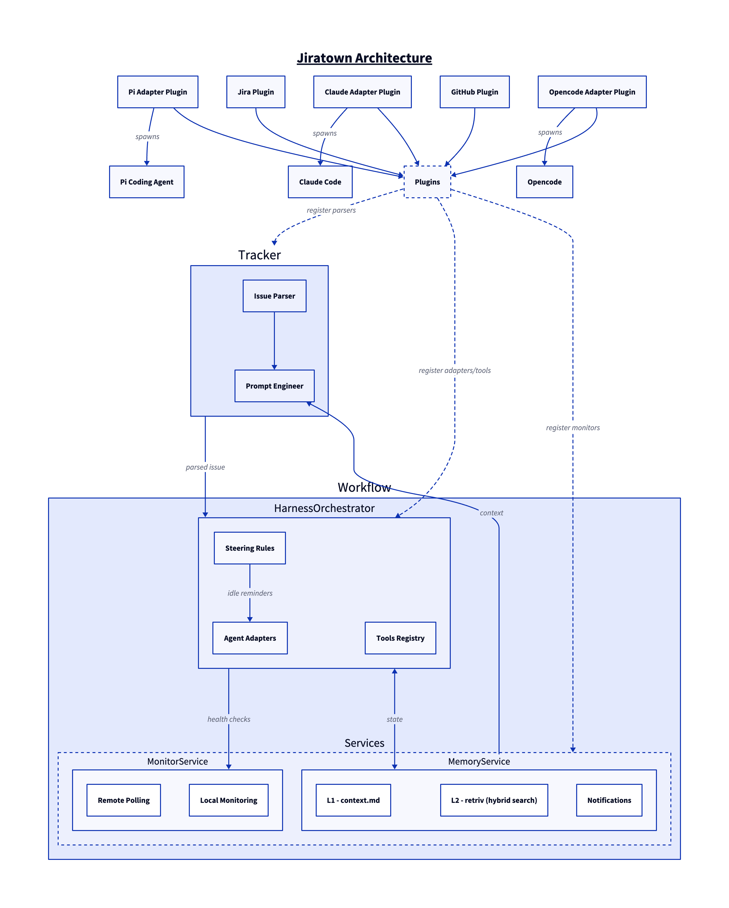

# Workhorse

An AI-powered agent orchestrator that manages coding agents working on Jira and GitHub issues.



## Installation

```bash
bun install
```

## Configuration

Workhorse uses TOML configuration files with cascading merge (global → project).

### Config File Locations

**Global** (first found wins):

1. `~/.workhorse.toml`
2. `~/.config/workhorse.toml`
3. `~/.config/workhorse/config.toml`

**Project**: `<repo>/.workhorse.toml`

Project config overrides global. Missing keys fall back to defaults.

### Data Directory

Application data (database, logs, cache) lives in:

- `~/.local/share/workhorse/`

Respects `XDG_DATA_HOME` if set: `$XDG_DATA_HOME/workhorse/`

### Example Config

```toml
[agent]
harness = "opencode"           # "opencode" | "claude-code" | "pi"
model = "sonnet-4"

[behavior]
auto_resume = true
poll_interval = 30000          # ms

[prompt]
custom = """
Project-specific instructions appended to every agent prompt.
"""

[ui]
theme = "tokyonight"

[plugins]
enabled = ["jira", "github"]

[plugins.jira]
cloud_id = "company.atlassian.net"

[plugins.github]
auto_poll_reviews = true
```

## Architecture

```
packages/
├── core/              # workhorse-core — main library
│   └── src/
│       ├── config/        # Config loading & validation
│       ├── context/       # Async context (useWorkhorse)
│       ├── db/            # SQLite via drizzle-orm
│       ├── lib/hooks/     # Event system (mitt)
│       ├── plugins/       # Plugin system & registry
│       ├── services/
│       │   ├── memory/    # L1 (context.md) + L2 (retriv hybrid search)
│       │   └── monitor/   # Polling framework
│       └── workflow/
│           ├── orchestrator/  # Agent lifecycle, adapters, tools
│           ├── steering/      # Idle reminders, autonomous rules
│           └── tracker/       # Issue parsing, prompt engineering
└── plugins/           # External plugins
    ├── github/        # workhorse-plugin-github
    ├── jira/          # workhorse-plugin-jira
    └── pi-adapter/    # workhorse-plugin-pi-adapter
```

### Key Concepts

- **Tracker** — Parses user input (ticket keys, URLs) via plugin-registered parsers, engineers prompts with context from MemoryService
- **HarnessOrchestrator** — Manages agent lifecycle via pluggable adapters registered by plugins
- **MemoryService** — L1 (per-worktree `context.md`) + L2 (semantic search via retriv) + notifications
- **MonitorService** — Polling framework for health checks and plugin-registered monitors
- **Plugins** — Hook into tracker, orchestrator, and services via `definePlugin()`. Agent harnesses (Pi, Claude Code, Opencode) are also plugins that register their adapters.

## Plugins

Plugins extend Workhorse's functionality. Define a plugin with optional config validation:

```typescript
import { definePlugin } from "workhorse-core";
import { z } from "zod/v4";

export default definePlugin({
  manifest: {
    name: "my-plugin",
    version: "1.0.0",
    description: "My custom plugin",
  },
  configSchema: z.object({
    apiKey: z.string(),
    timeout: z.number().default(5000),
  }),
  setup(config) {
    // Access services via useWorkhorse()
    console.log("Plugin initialized with:", config.apiKey);
  },
  teardown() {
    console.log("Plugin cleaned up");
  },
});
```

Plugin config is defined in the main config file under `[plugins.<name>]`:

```toml
[plugins.my-plugin]
api_key = "secret"
timeout = 10000
```

### Plugin Types

- **Integration plugins** — Connect to external services (Jira, GitHub)
- **Adapter plugins** — Register agent harness adapters (Pi, Claude Code, Opencode)

## Development

```bash
bun run check              # lint → typecheck → test → fallow
bun run test               # vitest across all packages
bun run typecheck          # tsc across all packages
bun run lint               # oxlint with custom rules
```

See [AGENTS.md](./AGENTS.md) for detailed coding conventions and contribution guidelines.

## Documentation

- [Architecture Overview](./docs/ARCHITECTURE.md) — Key concepts, data flow, configuration
- [Development Guide](./docs/DEVELOPMENT.md) — Commands, code constraints, testing
- [Plugin Guide](./docs/PLUGIN-GUIDE.md) — How to create plugins
- [Architecture Plan](./plan/workhorse-on-pi.md) — Workhorse-on-Pi architecture and build order

## License

MIT
