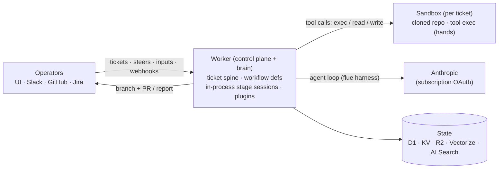

# Workhorse

**Controllable autonomous coding agents.** A Cloudflare-native fleet
orchestrator: file a ticket, an agent plans and implements it autonomously
in an isolated cloud sandbox, using a small model kept capable by giving it
the right tools and context at each workflow stage.

## Architecture



**Flue-first:** the agent loop runs **in the Worker** (via the
[flue](https://flueframework.com) harness), not as a subprocess. Each
workflow stage is one in-process `session.prompt(...)`; its tool calls
(`bash`/`read`/`write`, plugin tools) execute in the sandbox container over
RPC. The container is just hands — it holds the cloned repo and never holds a
model credential.

**Planes:**

| Plane | Runs on | What |
|---|---|---|
| Spine | Cloudflare Workflows | one durable instance per ticket: dispatch, drive, parks (`waitForEvent`), capacity waits (`step.sleep`), delivery |
| Engine | `packages/workflow` | hard-coded, eval-tested `WorkflowDef`s (declarative `stages` manifest + imperative `run(ctx)` routing) + the `ctx.stage()` helper. No interpreter, no spec registry. |
| Stage session | Worker (flue harness) | each `ctx.stage()` is one in-process flue session; tools are the plugins' `tools.ts` factories, intersected with the stage allowlist |
| Muscle | Cloudflare Sandbox | per-ticket container: the cloned repo + tool exec. No Pi, no baked model credential. |
| Brain | Anthropic (Claude subscription OAuth) | called from the Worker by the flue harness |
| Memory | D1 + KV + R2 + Vectorize + AI Search | records in D1; hot state in KV; blobs (traces, repo memory, dep cache) in R2; semantic registries (scripts/workflows/tools) in Vectorize; fleet-wide run knowledge in AI Search |
| Token custody | homelab server | holds+refreshes the OAuth refresh token; pushes short-lived access tokens to the Worker (`POST /token`) |
| Face | Nuxt UI (`ui/`) | chat-first home, fleet list, run-centric ticket page with live output, read-only workflow graph, agent blocks, `/embed` for dashboards |

**Workspace (hard boundaries):** `packages/api` is the contract; each
`plugins/<name>` package depends on it and nothing else (enforced by
workspace resolution); `worker/` is the only package that imports concrete
plugins. A plugin's stage tools live in `tools.ts` (worker-side flue tools);
an optional `extension.ts` (Pi tools for the fleet chat) is auto-discovered
by the sandbox image build.

**Workflows are code; the rest is data.** A workflow is a hard-coded,
eval-tested `WorkflowDef` in `packages/workflow` — adding one is a def + an
eval case, never an upload. Agent blocks (persona + tool ceiling, referenced
by `stage.agent`) and scripts (agent self-extension, D1 registry) remain
registry data editable from the UI. A workflow's terminal stage declares its
outcome — `pr` (external merge completes), `report`/`artifact` (operator
acceptance completes). Completion signals are pluggable
(`Core.signalTransition`): PR merge, Jira Done, and the UI's Accept button are
the same mechanism.

## Plugins

Each plugin is a single `plugins/<name>/` package with an optional worker half (routes, hooks) and an optional sandbox half (Pi extension). Plugins depend only on `@workhorse/api`; the worker is the sole composition point.

### browser
| | |
|---|---|
| Package | `plugins/browser` |
| Worker | No-op shell (BROWSER_TOKEN for sandbox auth) |
| Sandbox tools | `browser_open`, `browser_snapshot` (AX tree + refs), `browser_read`, `browser_act` (click/fill/type/scroll by ref), `browser_screenshot`, `browser_record` (timed frame capture → GIF) |
| Implementation | [agent-browser](https://github.com/vercel-labs/agent-browser) CLI daemon, persistent session per run; stateless reads use jina (`web_read`)|
| Secrets | `BROWSER_TOKEN` (scoped sandbox callback token — auto-injected) |

### github
| | |
|---|---|
| Package | `plugins/github` |
| Inbound | PR/issue webhooks → fileTicket, PR merge → done, PR close → terminated, PR comments → notification bus |
| Outbound | onStatusChange → PR comments (what changed, revision notes) |
| Sandbox tools | `gh_pr`, `gh_ci`, `gh_search_code`, `gh_commits` (read-only via scoped proxy) |
| Secrets | `GITHUB_TOKEN` (fleet GitHub PAT), `GITHUB_WEBHOOK_SECRET` (webhook HMAC) |

### slack
| | |
|---|---|
| Package | `plugins/slack` |
| Inbound | @mention → fleet chat or `trigger <name>` fire; thread replies → notification bus (urgent for live runs) |
| Outbound | onStatusChange → thread replies |
| Attachment providers | `slack` (thread, resolved on demand via `fetch_context`) |
| Triggers | `slack-mention` (Slack TriggerSource for `Core.fireTrigger`) |
| Secrets | `SLACK_SIGNING_SECRET` (webhook HMAC), `SLACK_BOT_TOKEN` (bot API) |

### jira
| | |
|---|---|
| Package | `plugins/jira` |
| Inbound | Issue assigned to agent account or labeled `workhorse` → fileTicket; comments → notification bus |
| Outbound | onStatusChange → issue transitions + PR-link comments |
| Attachment providers | `jira` (issue + comments, resolved on demand via `fetch_context`) |
| Triggers | `jira-mention` (Jira TriggerSource for `Core.fireTrigger`) |
| Secrets | `JIRA_BASE_URL`, `JIRA_EMAIL`, `JIRA_API_TOKEN` (Jira REST API), `JIRA_WEBHOOK_SECRET` (webhook HMAC), `JIRA_AGENT_ACCOUNT` (agent Jira username) |

### knowledge
| | |
|---|---|
| Package | `plugins/knowledge` |
| Sandbox tools | `search_fleet_knowledge` (AI Search semantic index of every past run) |
| Worker routes | `POST /knowledge/search` (federated search), `POST /knowledge/reindex` (backfill) |
| Bindings | `AI_SEARCH` (AutoRAG namespace), `BLOBS` (R2 bucket for trace storage) |

### imgup
| | |
|---|---|
| Package | `plugins/imgup` |
| Sandbox tools | `upload_image` (multi-host chain: imgbb → catbox → …, serve-verified) |
| Config | `WORKHORSE_IMGUP_BIN` (optional: path to imgup binary, default `/usr/local/bin/imgup`) |

### scripts
| | |
|---|---|
| Package | `plugins/scripts` |
| Sandbox tools | `list_scripts`, `run_script`, `write_script` |
| Worker routes | `GET/POST /scripts`, `GET /scripts/get?ticket=` |
| Registry | D1 `scripts` table; `.workhorse/scripts.toml` seeds |

### tickets
| | |
|---|---|
| Package | `plugins/tickets` |
| Stage tools | `fetch_context` (resolve a repo/Jira/Slack ref on demand — the enrichment path; refs are parsed from the task prompt, not manually attached) |
| Fleet-chat tools (`extension.ts`) | `workhorse_file_ticket`, `workhorse_list_tickets`, `workhorse_ticket_status`, `workhorse_ticket_diff`, `workhorse_find_workflow` (semindex-ranked workflow pick) |
| Worker routes | ticket CRUD, dispatch, `/refs` (frecency-ranked recent context refs), `/attachments/match`\|`/resolve`, notification bus (`notify`/`notifications`) |
| Attachment providers | `repo` (the "attach a repo" source) |

### paste
| | |
|---|---|
| Package | `plugins/paste` |
| Sandbox tools | `upload_text` (text → curl-able URL; paste.rs → 0x0.st fallback chain) |

### ntfy
| | |
|---|---|
| Package | `plugins/ntfy` |
| Outbound | onStatusChange/onTraceArchived → ntfy push (priority-mapped; silent when NTFY_URL unset) |
| Secrets | `NTFY_URL` (ntfy server, e.g. `https://ntfy.stevenjohn.co`), `NTFY_TOPIC` (topic name), `NTFY_TOKEN` (bearer auth, optional) |

### search
| | |
|---|---|
| Package | `plugins/search` |
| Sandbox tools | `web_search` (jina → exa fallback chain), `web_read` (jina reader, clean markdown) |
| Secrets | `JINA_API_KEY` (primary search/reader), `EXA_API_KEY` (fallback search), `TAVILY_API_KEY` / `BRAVE_API_KEY` (additional fallbacks) |

## Semantic index (not a plugin)

`packages/semindex` is a reusable Vectorize-backed index toolkit;
`worker/src/semindex.ts` defines the fleet corpora (scripts, workflows,
tools), reindexed via `POST /admin/reindex-semindex` and queried through
`GET /find?corpus=…`. The live query tool is `workhorse_find_workflow` (in the
tickets fleet-chat extension), which ranks workflows for a task before filing.

## API (bearer-gated)

```
POST /tickets {title?, repo, prompt, workflow?, inputs?} → durable run
GET  /tickets · GET /tickets/:id            → fleet list / record + live status
POST /tickets/:id/steer {message}           → interrupt + redirect the live stage
POST /tickets/:id/input {answers}           → answer an awaiting-input park
POST /tickets/:id/accept · /request-changes → acceptance verdicts (report/artifact)
POST /tickets/:id/heal · /stop              → re-dispatch errored / terminate
GET  /tickets/:id/activity · /output · /traces · /diff
POST /chat {messages}                       → fleet operator agent
GET  /workflows · GET /workflows/:name      → hard-coded workflow defs (read-only)
GET/PUT/DELETE /agents/:name                → agent block registry
GET  /scripts · POST /scripts               → script registry (scoped)
GET  /find?corpus=scripts|workflows|tools   → semantic search (scoped)
GET  /refs                                  → frecency-ranked recent context refs
POST /token · GET /token                    → custodian OAuth push · freshness
GET  /github?path=…                         → read-only GitHub proxy (scoped)
POST /webhooks/github · /slack · /jira      → verified sources
```

## Dev

```
bun install
bun run typecheck    # all workspace packages
bun run test         # vitest (workflow-def routing tests, mock ctx)
bun run eval         # evalite (evals/ — agent-vs-workflow + search providers)
bun run dev          # local worker (needs Docker for the sandbox container)
bun run deploy       # deploy worker + container image (from worker/)
```

Secrets: `SPIKE_TOKEN` (master bearer), `GITHUB_TOKEN`,
`GITHUB_WEBHOOK_SECRET`, `BROWSER_TOKEN` (scoped sandbox callbacks);
optional: `SLACK_SIGNING_SECRET` +
`SLACK_BOT_TOKEN` (Slack), `JIRA_BASE_URL`/`JIRA_EMAIL`/`JIRA_API_TOKEN`/
`JIRA_WEBHOOK_SECRET`/`JIRA_AGENT_ACCOUNT` (Jira intake), `NTFY_URL` +
`NTFY_TOPIC` (push), `TAVILY_API_KEY`/`EXA_API_KEY`/`BRAVE_API_KEY` +
`SEARCH_PROVIDER` (web search). Dev values in `.dev.vars` (git-ignored).

Roadmap: [ROADMAP.md](./ROADMAP.md). Legacy Workhorse (TS core, core-v2/v3,
Rust orchestrator) lives on the `legacy` branch.
