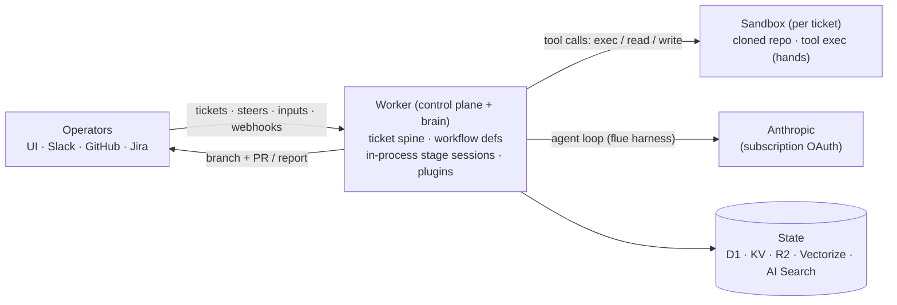

# Workhorse

[](https://github.com/StevenJPx2/workhorse/actions/workflows/ci.yml)
[](#quality)

**Controllable autonomous coding agents.** Workhorse runs a fleet of coding
agents on Cloudflare. You file a ticket. An agent plans the work and writes the
code in an isolated cloud sandbox. Each workflow stage gives a small model the
exact tools and context that stage needs.

## Architecture


```mermaid
flowchart LR
    OPS["Operators<br/>UI · Slack · GitHub · Jira"]
    WORKER["Worker (control plane + brain)<br/>ticket spine · workflow defs<br/>in-process stage sessions · plugins"]
    SANDBOX["Sandbox (per ticket)<br/>cloned repo · tool exec (hands)"]
    STATE[("State<br/>D1 · KV · R2 · Vectorize · AI Search")]
    LLM["Anthropic<br/>(subscription OAuth)"]

    OPS -->|"tickets · steers · inputs · webhooks"| WORKER
    WORKER -->|"tool calls: exec / read / write"| SANDBOX
    WORKER -->|"agent loop (flue harness)"| LLM
    WORKER --> STATE
    WORKER -->|"branch + PR / report"| OPS
```

The agent loop runs inside the Worker through the
[flue](https://flueframework.com) harness. It does not run as a subprocess. Each
workflow stage is one in-process `session.prompt(...)` call. The tool calls from
that stage run in the sandbox container over RPC. The container is only hands. It
holds the cloned repo, and it never holds a model credential.

### Planes

| Plane | Runs on | What it does |
|---|---|---|
| Spine | Cloudflare Workflows | One durable instance per ticket. It dispatches the run, drives it, parks it on `waitForEvent`, waits out capacity limits with `step.sleep`, and delivers the result. |
| Engine | `packages/workflow` | Hard-coded, eval-tested workflow definitions. Each one pairs a declarative `stages` manifest with imperative `run(ctx)` routing. No interpreter. No spec registry. |
| Stage session | Worker (flue harness) | Each stage is one in-process flue session. Its tools are the plugin tool factories, cut down to the stage allowlist. |
| Muscle | Cloudflare Sandbox | The per-ticket container. It holds the cloned repo and runs the tools. It holds no model credential. |
| Brain | Anthropic Claude (subscription OAuth) | The flue harness calls the model from the Worker. |
| Memory | D1, KV, R2, Vectorize, AI Search | D1 holds the records through Drizzle. KV holds hot state. R2 holds traces and the dependency cache. Vectorize holds the semantic registries. AI Search holds fleet run knowledge and per-repo agent memory. |
| Token custody | Homelab server | It holds the OAuth refresh token and keeps it fresh. It pushes short-lived access tokens to the Worker through `POST /token`. |
| Face | Nuxt UI (`ui/`) | A chat-first home page, the fleet list, a run-centric ticket page with live output, a read-only workflow graph, agent blocks, and `/embed` for dashboards. |

### Workspace boundaries

`packages/api` is the contract. It exports `tool()`, `agent()`, and the plugin
and Env types. Each `plugins/<name>` package depends on that contract and on
nothing else, and workspace resolution enforces the rule.

Every plugin exports its tools two ways. An array feeds plugin assembly. Named
bindings feed agents. A named import turns a typo into a compile error. An array
lookup turns the same typo into an empty allowlist and no error at all.

A `workflows/<name>` package composes agents from those tools. Only `worker/`
registers concrete plugins.

| Package | Owns |
|---|---|
| `packages/api` | `tool()`, `agent()`, and the plugin and Env contract |
| `packages/auth` | Request auth tiers and model-token custody |
| `packages/db` | Drizzle schema, repos such as `db.tickets.list()`, and migrations |
| `packages/events` | The event bus, steers, and the notification queue |
| `packages/intake` | Ticket filing, self-healing, and ref frecency |
| `packages/o11y` | Structured events on evlog, keyed by ticket, run, and stage |
| `packages/sandbox` | The container driver and Code Mode |
| `packages/semindex` | `defineIndex` over Vectorize and Workers AI |
| `packages/server` | The HTTP surface: routes, auth tiers, chat, triggers, agent blocks |
| `packages/test-utils` | The doubles and harnesses for all three test layers |
| `packages/workflow` | `workflow()`, stage graph discovery, and prompt assembly |
| `plugins/core` | The workspace tools every stage draws from: read, grep, bash, write, edit |
| `plugins/<name>` | One capability each, with a contract-only dependency |
| `workflows/<name>` | The agents and `run()` routing for one pipeline |
| `worker/` | The composition root, the ticket spine, and deployment |

### Workflows are code. The rest is data.

A workflow is a hard-coded, eval-tested definition in `workflows/<name>`. To add
one, write the definition and an eval case. You never upload a workflow. Three
workflows ship today: `coding`, `coding-nocode`, and `coding-raw`.

Coding agents live beside their workflow. Each agent carries its instructions,
output schema, plugin tools, and engine tools. Scripts remain registry data, and
D1 stores them for reuse.

A workflow's terminal stage declares its outcome. An outcome of `pr` completes
when somebody merges the PR. An outcome of `report` or `artifact` completes when
an operator accepts the result. Completion signals are pluggable
through `Core.signalTransition`, so a PR merge, a Jira Done transition, and the
UI Accept button all use one mechanism.

## Plugins

Each plugin is one `plugins/<name>/` package. A plugin can add a worker half for
routes and hooks. It can also add a sandbox half as a Pi extension. Every plugin
depends only on `@workhorse/api`, and the worker is the only composition point.

### aft
| | |
|---|---|
| Package | `plugins/aft` |
| Sandbox tools | `aft_outline` (file and directory structure), `aft_zoom` (one symbol's source), `aft_search` (regex across the tree), `aft_inspect` (diagnostics, dead code, duplicates) |
| Implementation | The `aft` binary speaks JSON-RPC over stdin. It is not an argv CLI. |

### browser
| | |
|---|---|
| Package | `plugins/browser` |
| Worker | A no-op shell. It only holds `BROWSER_TOKEN` for sandbox auth. |
| Sandbox tools | `browser_open`, `browser_snapshot` (AX tree and refs), `browser_read`, `browser_act` (click, fill, type by ref), `browser_key`, `browser_scroll`, `browser_screenshot`, `browser_record` (native capture to GIF) |
| Implementation | The [agent-browser](https://github.com/vercel-labs/agent-browser) CLI holds one session per run. Headful Chrome runs under Xvfb, because bot walls block headless. |
| Secrets | `BROWSER_TOKEN`, a scoped sandbox callback token that the worker injects |

### github
| | |
|---|---|
| Package | `plugins/github` |
| Inbound | A PR or issue webhook files a ticket. A merge marks the ticket done. A close terminates it. PR comments go to the notification bus. |
| Outbound | A status change posts a PR comment that states what changed. |
| Sandbox tools | `gh_pr`, `gh_ci`, `gh_search_code`, `gh_commits`, all read-only through a scoped proxy |
| Secrets | `GITHUB_TOKEN` (fleet PAT), `GITHUB_WEBHOOK_SECRET` (webhook HMAC) |

### imgup
| | |
|---|---|
| Package | `plugins/imgup` |
| Sandbox tools | `upload_image`, which tries imgbb first and falls back through catbox and others, then verifies the served image |
| Config | `WORKHORSE_IMGUP_BIN` sets the binary path. The default is `/usr/local/bin/imgup`. |

### jira
| | |
|---|---|
| Package | `plugins/jira` |
| Inbound | Workhorse files a ticket when somebody assigns an issue to the agent account or labels it `workhorse`. Comments go to the notification bus. |
| Outbound | A status change transitions the issue and posts the PR link. |
| Attachment providers | `jira` resolves an issue and its comments on demand through `fetch_context` |
| Triggers | `jira-mention`, a Jira trigger source for `Core.fireTrigger` |
| Secrets | `JIRA_BASE_URL`, `JIRA_EMAIL`, `JIRA_API_TOKEN`, `JIRA_WEBHOOK_SECRET`, `JIRA_AGENT_ACCOUNT` |

### knowledge
| | |
|---|---|
| Package | `plugins/knowledge` |
| Sandbox tools | `search_fleet_knowledge` (every past run, every repo), `memory_search` and `memory_write` (durable facts about this repo) |
| Worker routes | `POST /knowledge/search`, `POST /knowledge/reindex` |
| Bindings | `AI_SEARCH` (the AI Search namespace), `BLOBS` (the R2 bucket that holds traces) |
| Corpora | One AI Search instance holds two namespaced corpora: distilled run traces, and per-repo memory. Memory replaced Magic Context. It uses the same retrieval stack, it commits on write, and it scopes every fact to one repo. |

### ntfy
| | |
|---|---|
| Package | `plugins/ntfy` |
| Outbound | A status change or an archived trace sends an ntfy push. Priority maps from the event. The plugin stays silent when `NTFY_URL` is not set. |
| Secrets | `NTFY_URL` (the ntfy server), `NTFY_TOPIC` (the topic name), `NTFY_TOKEN` (optional bearer auth) |

### paste
| | |
|---|---|
| Package | `plugins/paste` |
| Sandbox tools | `upload_text` turns text into a URL that curl can read. It tries paste.rs first, then 0x0.st. |

### scripts
| | |
|---|---|
| Package | `plugins/scripts` |
| Sandbox tools | `list_scripts`, `write_script`. `run_script` is an engine builtin, not a plugin tool, because replaying a saved program needs the stage's authentic bridge props. |
| Worker routes | `GET/POST /scripts`, `GET /scripts/get?ticket=` |
| Registry | The D1 `scripts` table. A repo's `.workhorse/scripts.toml` seeds it. |

### search
| | |
|---|---|
| Package | `plugins/search` |
| Sandbox tools | `web_search` (jina first, then exa), `web_read` (the jina reader, which returns clean markdown) |
| Secrets | `JINA_API_KEY` (primary), `EXA_API_KEY` (fallback), `TAVILY_API_KEY` and `BRAVE_API_KEY` (further fallbacks) |

### slack
| | |
|---|---|
| Package | `plugins/slack` |
| Inbound | An @mention starts a fleet chat or fires `trigger <name>`. Thread replies go to the notification bus, and a live run treats them as urgent. |
| Outbound | A status change posts a thread reply. |
| Attachment providers | `slack` resolves a thread on demand through `fetch_context` |
| Triggers | `slack-mention`, a Slack trigger source for `Core.fireTrigger` |
| Secrets | `SLACK_SIGNING_SECRET` (webhook HMAC), `SLACK_BOT_TOKEN` (bot API) |

### tickets
| | |
|---|---|
| Package | `plugins/tickets` |
| Stage tools | `fetch_context` resolves one repo, Jira, or Slack ref on demand. Workhorse parses refs out of the task prompt, so nobody attaches them by hand. |
| Fleet-chat tools | `workhorse_file_ticket`, `workhorse_list_tickets`, `workhorse_ticket_status`, `workhorse_ticket_diff`, `workhorse_find_workflow` (semindex picks the workflow) |
| Worker routes | Ticket CRUD, dispatch, `/refs` (recent refs ranked by frecency), `/attachments/match` and `/resolve`, and the notification bus |
| Attachment providers | `repo`, the source behind "attach a repo" |

### todo
| | |
|---|---|
| Package | `plugins/todo` |
| Sandbox tools | `todo_write` (create the ordered list), `todo_read`, `todo_update` |
| Store | One JSON file per run at `/workspace/.workflow/todos.json`. The planner writes the list. The coder works through it one item at a time. |

## Semantic index

`packages/semindex` is a reusable toolkit over Vectorize.
`packages/server/src/semindex.ts` defines the fleet corpora: scripts, workflows,
and tools. `POST /admin/reindex-semindex` rebuilds them, and
`GET /find?corpus=…` queries them. The live tool is `workhorse_find_workflow`,
which ranks workflows for a task before Workhorse files the ticket.

## API

Every route needs a bearer token.

```
POST /tickets {title?, repo, prompt, workflow?, inputs?} → durable run
GET  /tickets · GET /tickets/:id            → fleet list / record + live status
POST /tickets/:id/steer {message}           → interrupt + redirect the live stage
POST /tickets/:id/input {answers}           → answer an awaiting-input park
POST /tickets/:id/accept · /request-changes → acceptance verdicts (report/artifact)
POST /tickets/:id/heal · /stop              → re-dispatch errored / terminate
GET  /tickets/:id/activity · /output · /traces · /diff
POST /chat {messages}                       → fleet operator agent
GET  /workflows · GET /workflows/:name      → hard-coded workflow defs (read-only)
GET/PUT/DELETE /agents/:name                → agent block registry
GET  /scripts · POST /scripts               → script registry (scoped)
GET  /find?corpus=scripts|workflows|tools   → semantic search (scoped)
GET  /refs                                  → frecency-ranked recent context refs
POST /token · GET /token                    → custodian OAuth push · freshness
GET  /github?path=…                         → read-only GitHub proxy (scoped)
POST /webhooks/github · /slack · /jira      → verified sources
```

## Dev

```
bun install
bun run check         # lint, typecheck, and per-package health — the local gate
bun run test          # vitest across every package
bun run test:contract # contract suites against real binaries
bun run report        # rebuild the quality report and the README table
bun run secrets       # audit the secret contract against the deployed worker
bun run eval          # evalite over evals/
bun run dev           # local worker — needs Docker for the sandbox container
bun run deploy        # deploy the worker and the container image
```

The contract suites need `agent-browser`, `aft`, and `imgup` on the path, so CI
skips them. Run them yourself after you change a tool that shells out.

[`secrets.json`](./secrets.json) declares every secret. Each entry states its
purpose, what breaks without it, and where to get it. Run
`bun run secrets:missing` to print the exact command for each gap. Dev values
live in `.dev.vars`, which git ignores.

## Quality

<!-- quality:start -->


**29 packages** · 1246 passing · all at or above floor

| package | grade | score | trend |
|---|---|---:|---|
| `ui` | A | 87.2 | `▇▇▇▇▇▇▇▇▇▇▇▇▇▇` |
| `worker` | A | 88.3 | `▅▅▅▅▅▅▅▅▇▇▇▇▇▇` |
| `plugins/github` | A | 90.0 | `▇▇▇▇▇▇▇▇▇▇▇▇▇▇` |
| `plugins/jira` | A | 90.0 | `▇▇▇▇▇▇▇▇▇▇▇▇▇▇` |
| `plugins/slack` | A | 90.0 | `▇▇▇▇▇▇▇▇▇▇▇▇▇▇` |
| `packages/db` | A | 98.2 | `█████████` |
| `packages/workflow` | A | 99.8 | `██████████████` |
| `evals` | A | 100.0 | `██████████████` |
| `packages/api` | A | 100.0 | `██████████████` |
| `packages/auth` | A | 100.0 | `█████████` |
| `packages/events` | A | 100.0 | `███` |
| `packages/intake` | A | 100.0 | `███` |
| `packages/o11y` | A | 100.0 | `██` |
| `packages/sandbox` | A | 100.0 | `███` |
| `packages/semindex` | A | 100.0 | `██████████████` |
| `packages/server` | A | 100.0 | `███` |
| `packages/test-utils` | A | 100.0 | `██████████████` |
| `plugins/aft` | A | 100.0 | `██████████████` |
| `plugins/browser` | A | 100.0 | `██████████████` |
| `plugins/core` | A | 100.0 | `███████` |
| `plugins/imgup` | A | 100.0 | `██████████████` |
| `plugins/knowledge` | A | 100.0 | `██████████████` |
| `plugins/ntfy` | A | 100.0 | `██████████████` |
| `plugins/paste` | A | 100.0 | `██████████████` |
| `plugins/scripts` | A | 100.0 | `██████████████` |
| `plugins/search` | A | 100.0 | `██████████████` |
| `plugins/tickets` | A | 100.0 | `██████████████` |
| `plugins/todo` | A | 100.0 | `██████████████` |
| `workflows/coding` | A | 100.0 | `███████` |

<sub>Generated by `bun run report` · fixed 0–100 scale · test files excluded from scoring</sub>
<!-- quality:end -->

Run `bun run report` to rebuild the table above. Every PR gets the same digest on
its [Actions run summary](https://github.com/StevenJPx2/workhorse/actions), plus
a `quality-report` artifact that holds the full HTML view.

The roadmap lives in [ROADMAP.md](./ROADMAP.md). The legacy Workhorse, with its
TypeScript core and Rust orchestrator, lives on the `legacy` branch.
