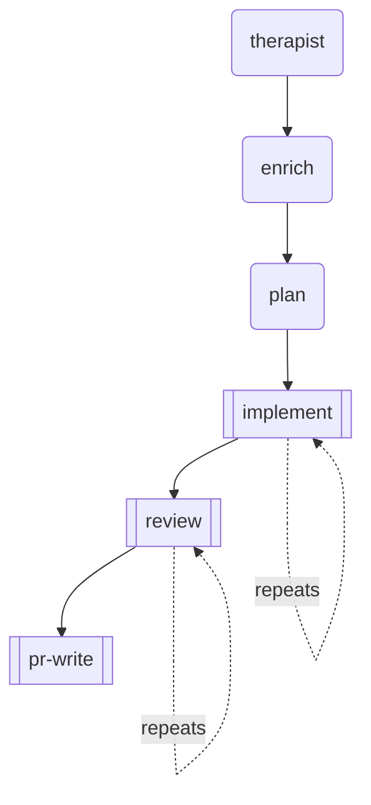

# @workhorse/workflow-coding

The multi-agent pull-request pipeline.

Each stage is one agent with a fresh context, its own tool list, and a valibot
output schema. A stage receives only the upstream artifacts it is given.

## Shape

Double borders mark a stage that repeats: `implement` and `review` run once per
todo, and `review` can send work back to `implement` at most twice.

## Agents

| Agent | Job |
|---|---|
| `enricher` | Turns a task into a brief, resolving refs it needs. |
| `planner` | Writes the ordered todo list. |
| `coder` | Implements one todo. |
| `reviewer` | Accepts the change, or sends it back with blocking findings. |
| `writer` | Writes the PR body. |
| `therapist` | Collates review feedback on a revision run. |
| `GATHER_TOOLS` | Shared read-only context surface used by the enricher and therapist. |

## Notes

The graph above is DERIVED, not declared. `run(ctx)` is imperative TypeScript, so
discovery runs it against stub outputs and records each `ctx.run(agent, …)` call.
The test snapshot pins the result, which makes an accidental rewiring a visible
diff rather than a silent change.

The therapist appears only when discovery seeds a revision `runId`. `run()` reaches
it through `runId.includes("-rev")`, and no stub polarity varies a run id. That is a
real limit of discovery, not a missing edge.

The PR body accumulates. Each `pr-write` visit returns the full body, and the
terminal analysis is the description.

Whether the PR body includes screenshots depends on the coder's own `uiChanges`
flag. That routes to a stage with the same persona and a wider tool list.

Every agent imports its tools by name from the plugin packages, so a typo is a
compile error rather than a silently empty allowlist.

## Tests

`bunx vitest run --project workflows`
